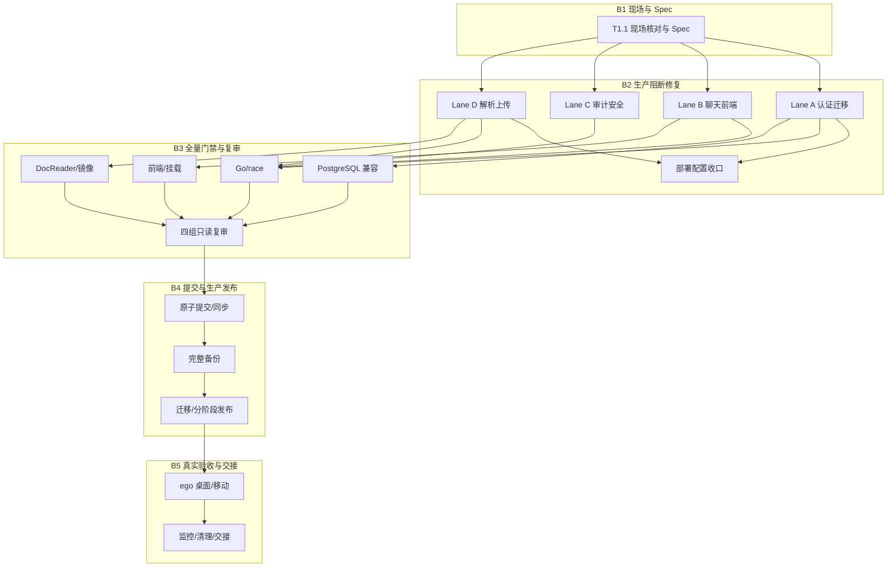

# 依赖图

```mermaid
flowchart TD
  subgraph B1["B1 现场与 Spec"]
    T11["T1.1 现场核对与 Spec"]
  end
  subgraph B2["B2 生产阻断修复"]
    T21["Lane A 认证迁移"]
    T22["Lane B 聊天前端"]
    T23["Lane C 审计安全"]
    T24["Lane D 解析上传"]
    T25["部署配置收口"]
  end
  subgraph B3["B3 全量门禁与复审"]
    T31["Go/race"]
    T32["前端/挂载"]
    T33["DocReader/镜像"]
    T34["PostgreSQL 兼容"]
    T35["四组只读复审"]
  end
  subgraph B4["B4 提交与生产发布"]
    T41["原子提交/同步"] --> T42["完整备份"] --> T43["迁移/分阶段发布"]
  end
  subgraph B5["B5 真实验收与交接"]
    T51["ego 桌面/移动"] --> T52["监控/清理/交接"]
  end

  T11 --> T21
  T11 --> T22
  T11 --> T23
  T11 --> T24
  T21 --> T25
  T24 --> T25
  T21 --> T31
  T22 --> T31
  T23 --> T31
  T24 --> T31
  T22 --> T32
  T24 --> T33
  T21 --> T34
  T31 --> T35
  T32 --> T35
  T33 --> T35
  T34 --> T35
  T35 --> T41
  T43 --> T51
```
